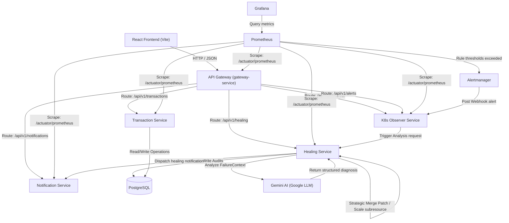

# AIOps: AI-Powered Closed-Loop Self-Healing Platform

A production-grade, distributed, **5-microservice AIOps Platform** built to implement automated closed-loop observability and remediation inside Kubernetes. The platform monitors workloads, parses crash dumps and logs using the **Google Gemini LLM**, patches container limits and replicas automatically using the **Kubernetes Java Client**, and audits operations in PostgreSQL.

---

## 🏗️ Architecture Overview

The system routes all external SRE requests through an API Gateway, communicates internally using declarative REST clients, persists state in PostgreSQL, and orchestrates remediation loops via the Kubernetes API server.



---

## ⚡ Core Features

1.  **AI Diagnosis Center**: Gathers container stdout logs and node events during failures. Uses the Google Gemini API to analyze the dump and recommend a whitelisted mutation action.
2.  **Kubernetes Java Client Mutations**: Scales deployments using the native Scale Subresource API and overrides resource constraints using Strategic Merge Patching.
3.  **Lens-like SRE Workloads Dashboard**: Multi-namespace search, status chips, pod restart counters, and ready container counts queried from the live cluster.
4.  **Prometheus & JVM Scrapers**: Pulls CPU/Memory utilization, JVM threads, GC pause times, and HTTP status codes, mapped on a real-time rolling timeline.
5.  **Interactive Timelines & drawers**: Chronological stepper tracers for healing operations showing duration, whitelists, and logs; sliding drawers for SRE audit log correlation traces.

---

## 🛠️ Technology Stack

### Backend Services
- **Java 17 / Spring Boot 3.x**
- **Spring Cloud Gateway** (Reverse proxy & load balancing)
- **Spring Cloud OpenFeign** (Declarative REST client calls)
- **Spring Data JPA / Hibernate**
- **Kubernetes Java SDK Client** (`io.kubernetes:client-java`)
- **PostgreSQL 15 (Alpine)**

### Observability & Alerting
- **Prometheus v2.51.1** (Telemetry metrics database)
- **Grafana 10.4.2** (Automated provisioning & dashboards)
- **Alertmanager v0.27.0** (Webhook alerting aggregator)

### Frontend Console
- **React 19 & TypeScript**
- **Vite & TailwindCSS v3**
- **TanStack Query (React Query v5) & Axios**
- **Recharts** (Visual performance timeline)
- **Sonner Toast System** (Real-time SRE status broadcasts)

---

## 📁 Repository Structure

```text
project-aiops/
├── docker/                 # Scrape configs for Prometheus and Alertmanager
├── docs/                   # Platform architecture, deployment, and troubleshooting guides
├── frontend/               # React Vite TS web application
├── gateway-service/        # Spring Cloud Gateway routing proxies
├── healing-service/        # Core AI healing and Gemini orchestrator
├── k8s-observer-service/   # Kubernetes client log watchers & RBAC telemetry
├── notification-service/   # Notification logs registry
├── transaction-service/    # Fault-injection target app (OOM leaks)
├── k8s/                    # Deployments, Services, RBAC yaml templates
│   ├── alertmanager/
│   ├── gateway/
│   ├── grafana/            # Automated datasource & dashboard manifests
│   ├── healing/
│   ├── observer/
│   ├── postgres/
│   ├── prometheus/
│   └── transaction/
└── pom.xml                 # Maven multi-module parent configurations
```

---

## 🚀 Setup & Execution Guide

### Local Development Setup

1.  **Compile JAR archives**:
    ```powershell
    mvn clean package -DskipTests
    ```
2.  **Start Database & Observability Stack**:
    ```powershell
    docker-compose up -d
    ```
3.  **Run Microservices**:
    Run each application main class pointing to local profiles.
4.  **Run React App**:
    ```powershell
    cd frontend
    npm install
    npm run dev
    ```

### Kubernetes Deployment (Minikube)

1.  **Point Shell to Minikube Docker Registry**:
    ```powershell
    minikube docker-env | Invoke-Expression
    ```
2.  **Build Microservices Images**:
    ```powershell
    docker build -t projectaiops-gateway-service:latest ./gateway-service
    docker build -t projectaiops-transaction-service:latest ./transaction-service
    docker build -t projectaiops-notification-service:latest ./notification-service
    docker build -t projectaiops-healing-service:latest ./healing-service
    docker build -t projectaiops-k8s-observer-service:latest ./k8s-observer-service
    ```
3.  **Apply secrets**:
    ```powershell
    kubectl apply -f k8s/namespace.yaml
    kubectl create secret generic postgres-secret --from-literal=database=aiops_db --from-literal=username=aiops_user --from-literal=password=aiops_pass -n aiops
    kubectl create secret generic gemini-secret --from-literal=gemini-api-key=YOUR_GEMINI_KEY -n aiops
    ```
4.  **Apply Workloads**:
    ```powershell
    kubectl apply -R -f k8s/
    ```
5.  **Start Port Forwarding**:
    ```powershell
    kubectl port-forward svc/gateway-service 8080:8080 -n aiops
    kubectl port-forward svc/grafana 3000:3000 -n aiops
    ```

---

## ⚙️ Environment Variables

- `GEMINI_API_KEY`: Required in `healing-service` to connect with Google LLM Studio.
- `SPRING_PROFILES_ACTIVE`: Set to `docker` inside Kubernetes to enable service name discovery.
- `VITE_API_BASE_URL`: Loaded in SRE Frontend, points to Gateway endpoint (`http://localhost:8080`).

---

## 📡 API Route Mappings

| HTTP Method | Route | Target Service | Description |
| :--- | :--- | :--- | :--- |
| **GET** | `/api/v1/transactions` | `transaction-service` | Fetch transactions history |
| **GET** | `/api/v1/transactions/fault/oom` | `transaction-service` | Trigger out-of-memory heap leak |
| **GET** | `/api/v1/healing` | `healing-service` | Fetch self-healing audit logs |
| **GET** | `/api/v1/healing/analysis/stats` | `healing-service` | Database-computed AI latencies |
| **GET** | `/api/v1/observer/kubernetes` | `k8s-observer-service` | Retrieve active pods and workloads |
| **POST** | `/api/v1/alerts` | `k8s-observer-service` | Webhook receiver for Alertmanager |

---

## 📸 Screenshots

*(Place dashboard, Grafana charts, and interactive drawers screenshots here)*

---

## 🛡️ License

This project is released under the **MIT License**.