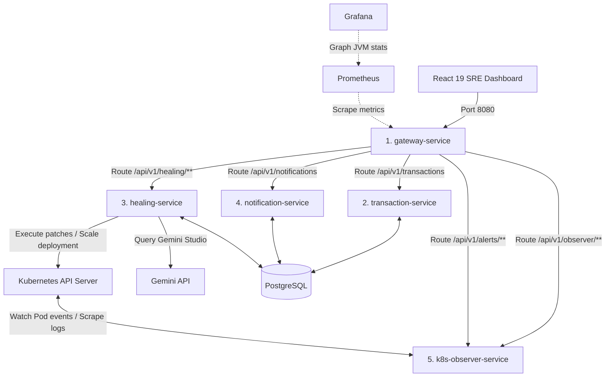

# AI-Powered Self-Healing AIOps Platform

This is a production-grade **5-microservice AIOps Platform** built as a CSE capstone project. The platform implements a distributed, closed-loop self-healing process: it monitors Kubernetes cluster workloads (e.g. CPU/Memory exhaustion, `OOMKilled`, `CrashLoopBackOff`), parses crash logs using the **Gemini API**, patches container limits automatically using the **Kubernetes Java Client**, and audits operations in PostgreSQL.

---

## 🏗️ System Architecture

### Distributed Microservice Topology
All client communications route through the API Gateway on port `8080`. Microservices communicate internally using type-safe declarative REST clients (**Spring Cloud OpenFeign**):



---

## ⚡ Core Features

1.  **AI Diagnosis Center**: Feeds crashing container logs and event logs into the Gemini API using prompt structures to diagnose root causes and suggest whitelisted solutions.
2.  **Kubernetes Java Client Mutations**: Automatically restarts failing pods or patches resource limits in the cluster namespace, verified by liveness loops.
3.  **Lens-like Workloads Dashboard**: Interactive tabbed view displaying live pods, deployments, services, and namespaces using active Kubernetes APIs.
4.  **Prometheus & JVM Scrapers**: Exposes system-level metrics via Spring Boot Actuator, plotted on moving Recharts graphs.
5.  **Audit Ledger & Alerts Feed**: Tracks alertmanager alarm caches, notification dispatches, and healing history joined on `correlationId` keys.

---

## 🛠️ Technology Stack

### Backend Microservices
*   **Java 17 & Spring Boot 3.x**
*   **Spring Cloud Gateway** & **Spring Cloud OpenFeign**
*   **Spring Data JPA** & **Hibernate**
*   **Kubernetes Java SDK Client** (`io.kubernetes:client-java`)
*   **PostgreSQL 15 (Alpine)**

### Frontend Observability Dashboard
*   **React 19** & **TypeScript**
*   **Vite** & **TailwindCSS v3**
*   **TanStack Query** (React Query v5) & **Axios**
*   **Recharts** (Visual timeline metrics)
*   **Lucide React** & **Framer Motion**

---

## 📂 Project Directory Structure

```text
project-aiops/
├── docker/                 # Scrape configs for Prometheus and Alertmanager
├── docs/                   # Development journals and phase logs
├── frontend/               # React Vite TS web application
├── gateway-service/        # Spring Cloud Gateway routing proxies
├── healing-service/        # Core AI healing and Gemini orchestrator
├── k8s-observer-service/   # Kubernetes client log watchers
├── notification-service/   # Notification audits logging
├── transaction-service/    # Fault-injection target app (OOM leaks)
├── k8s/                    # Deployments, Services, RBAC yaml templates
├── scripts/                # Launch script helpers (batch files)
└── pom.xml                 # Maven multi-module parent configurations
```

---

## 🚀 Setup & Execution Guide

### Prerequisites
*   Java JDK 17+ & Maven
*   Node.js v18+ & NPM
*   Docker Desktop (with Compose capability active)
*   Minikube or local Kubernetes cluster (for K8s testing)

### 1. Compile & Build Locally
Package the Spring Boot jar archives:
```powershell
# Compile all modules via Maven
mvn clean package -DskipTests
```
Build the React SPA bundle:
```powershell
cd frontend
npm install
npm run build
```

### 2. Launch Local Dev Stack (Docker Compose)
Launch PostgreSQL, Prometheus, and Grafana:
```powershell
docker-compose up -d
```
All microservices can be run locally on their standard ports (`8080`-`8084`) pointing to `localhost`.

### 3. Deploy to Kubernetes (Minikube)
1.  Initialize the cluster namespace:
    ```bash
    kubectl apply -f k8s/namespace.yaml
    ```
2.  Create database secrets and LLM tokens:
    ```bash
    kubectl create secret generic postgres-secret --from-literal=database=aiops_db --from-literal=username=aiops_user --from-literal=password=aiops_pass -n aiops
    kubectl create secret generic gemini-secret --from-literal=gemini-api-key=YOUR_GEMINI_KEY -n aiops
    ```
3.  Deploy workloads:
    ```bash
    kubectl apply -R -f k8s/
    ```

---

## 🔍 Closed-Loop AI Self-Healing Flow Simulation

Trigger a JVM Memory Leak on the transaction service to test the entire closed-loop pipeline:

```bash
# 1. Trigger OOM leak via the Gateway proxy
curl http://localhost:8080/api/v1/transactions/fault/oom
```

### Flow Lifecycle
1.  **Fault**: The Java heap exhausts, triggering an `OOMKilled` container termination event.
2.  **Observer**: `k8s-observer-service` intercepts the pod crash state, fetches the last 50 lines of container logs, and constructs a Failure Context.
3.  **AI Analysis**: The context is sent to the `healing-service`. Gemini analyzes the stacktrace (`java.lang.OutOfMemoryError`) and suggests an `INCREASE_MEMORY_LIMIT` mutation.
4.  **Remediation**: The Kubernetes client patches the deployment limit (e.g. `256Mi` $\rightarrow$ `512Mi`).
5.  **Cooldown check**: A background thread waits for 60 seconds (cooldown) and verifies if the pod restarted successfully.
6.  **Audit**: The audit ledger logs the result, dispatching alert notifications to SRE timelines.