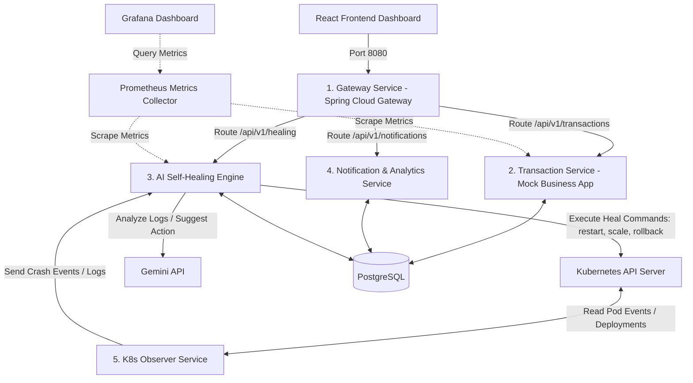

# Capstone Project Guide: AI-Powered Self-Healing AIOps Platform
This document provides a highly structured, step-by-step roadmap to build a 5-microservice AIOps platform with an AI self-healing module using the Gemini API, Docker, Kubernetes, React, and PostgreSQL. It is designed to be completed in 1 to 2 weeks (2–4 hours daily, ~30–40 hours total) by strategically leveraging AI as a force multiplier while ensuring you understand every line of code for your final capstone defense.

---

## 1. System Architecture & Components
To achieve the 5-microservice requirement without overwhelming your timeline, we will build a clean, modular microservice architecture. 



### The 5 Microservices (Java & Spring Boot):
1. **Gateway Service (`gateway-service`)**: Front-facing Spring Cloud Gateway that handles API routing and basic rate limiting.
2. **Transaction Service (`transaction-service`)**: A standard Spring Boot CRUD microservice connected to PostgreSQL. It has hidden endpoints (`/fault/oom` and `/fault/leak`) to artificially trigger memory leaks or JVM crashes so you can demo the self-healing.
3. **K8s Observer Service (`k8s-observer-service`)**: Uses the **Kubernetes Java Client** to watch for pod events (`OOMKilled`, `CrashLoopBackOff`, `FailedScheduling`). When a crash happens, it grabs the last 50 lines of logs and sends them to the Self-Healing Engine.
4. **AI Self-Healing Engine (`healing-service`)**: The core AI module. It communicates with the Gemini API to analyze the logs, determine the root cause, and call the Kubernetes API to apply the fix (e.g., delete pod to restart, increase resources, rollback deployment).
5. **Notification & Analytics Service (`notification-service`)**: Persists the healing history in PostgreSQL, manages system statistics, and exposes REST endpoints for the React dashboard.

---

## 2. 6-Stage Development Roadmap (14 Days, 2-4 hours/day)

### Stage 1: Workspace & Local Dev Environment Setup (Days 1–2)
* **Goal**: Establish the project workspace, build folders, configure a multi-module Maven/Gradle build, and run PostgreSQL locally.
* **Estimated Time**: 4–6 hours
* **How to divide labor**:
  * **Manual**: Directory structure creation, installing local requirements (Docker Desktop, Minikube/Kind, Java 17+, Maven, Node.js).
  * **AI Assistance**: Generating parent `pom.xml` configuration, setting up a unified `docker-compose.yml` for local development tools (PostgreSQL, Prometheus, Grafana).

#### Action Steps:
1. Initialize a Git repository in your workspace.
2. Define a multi-module project structure:
   ```text
   project-aiops/
   ├── pom.xml (Parent POM)
   ├── gateway-service/
   ├── transaction-service/
   ├── k8s-observer-service/
   ├── healing-service/
   ├── notification-service/
   ├── frontend/ (React UI)
   ├── k8s/ (Kubernetes manifests)
   └── docker-compose.yml (Local infrastructure)
   ```
3. Use Spring Initializr (`start.spring.io`) or use AI to generate the bootstrap files for each of the 5 services.
4. Set up `docker-compose.yml` containing PostgreSQL, PGAdmin, Prometheus, and Grafana.

---

### Stage 2: Core Microservices & Database Integration (Days 3–5)
* **Goal**: Build the core data-handling microservices, establish routing, and implement database tables.
* **Estimated Time**: 8–10 hours
* **How to divide labor**:
  * **Manual**: Writing JPA entities, mapping database columns, writing custom controller logic for database operations.
  * **AI Assistance**: Generating Spring Cloud Gateway routing configurations, writing boilerplate Spring Data JPA repositories, and creating Flyway/Liquibase SQL schemas for PostgreSQL.

#### Action Steps:
1. **Gateway**: Configure `application.yml` with routes pointing to other services using Spring Cloud Gateway.
2. **Transaction Service**: 
   * Implement a standard entity (e.g., `Transaction` with fields: `id`, `amount`, `status`, `timestamp`).
   * **Crucial for Testing**: Add a controller `/api/v1/transactions/fault` that triggers a JVM memory leak using a static list:
     ```java
     private static final List<byte[]> leakList = new ArrayList<>();
     @GetMapping("/oom")
     public ResponseEntity<String> triggerOom() {
         new Thread(() -> {
             while (true) {
                 leakList.add(new byte[1024 * 1024]); // Leak 1MB at a time
             }
         }).start();
         return ResponseEntity.ok("OOM Triggered");
     }
     ```
3. **Notification Service**: Setup database tables to log healing actions (`healing_history` with fields: `id`, `pod_name`, `error_detected`, `gemini_analysis`, `remediation_action`, `status`, `timestamp`).

---

### Stage 3: Kubernetes Observer Service (Days 6–7)
* **Goal**: Write a lightweight Kubernetes agent in Java that listens to cluster events and reads logs.
* **Estimated Time**: 6–8 hours
* **How to divide labor**:
  * **Manual**: Running pods locally in Minikube, checking logs, verifying permissions (RBAC).
  * **AI Assistance**: Generating the Kubernetes Java SDK client code, writing watch loop filters for specific event categories (OOMKilled, CrashLoopBackOff), and writing RBAC manifests (`ClusterRole`, `ClusterRoleBinding`, `ServiceAccount`).

#### Action Steps:
1. Add the Kubernetes Java Client dependency (`io.kubernetes:client-java`) to the `k8s-observer-service`.
2. Write a watch loop service to monitor pod status:
   * Filter for pods where the container state is `Waiting` with reason `CrashLoopBackOff` OR `Terminated` with reason `OOMKilled`.
3. Implement a log reader method:
   * Query the K8s API for the last 50 lines of logs of the crashing pod: `client.readNamespacedPodLog(podName, namespace, containerName, null, null, null, 50, null, null, null)`.
4. When a failure is detected, post a payload to the AI Self-Healing Engine:
   ```json
   {
     "podName": "transaction-service-xxxxx",
     "namespace": "default",
     "reason": "OOMKilled",
     "logs": "java.lang.OutOfMemoryError: Java heap space...",
     "exitCode": 137
   }
   ```

---

### Stage 4: AI Self-Healing Engine (Days 8–9)
* **Goal**: Integrate the Gemini API, construct robust prompts, parse the AI's response, and call K8s to apply self-healing.
* **Estimated Time**: 8–10 hours
* **How to divide labor**:
  * **Manual**: Designing the prompt template, implementing REST endpoints, coding the healing controller logic.
  * **AI Assistance**: Generating JSON parsing schemas, writing client code for the Gemini API, formulating the precise prompt instruction set for Gemini, and writing Kubernetes Java SDK resource patching code (e.g. patch deployment limits).

#### Action Steps:
1. Get a free API Key from Google AI Studio.
2. In the `healing-service`, write a class `GeminiClient` that makes a HTTP POST request to: `https://generativelanguage.googleapis.com/v1beta/models/gemini-1.5-flash:generateContent?key=YOUR_API_KEY`.
3. Construct a Structured JSON Prompt. Instruct Gemini to output ONLY valid JSON containing the remediation action:
   * Example Actions: `RESTART`, `INCREASE_RESOURCES`, `ROLLBACK`.
4. Implement the execution block:
   * **If RESTART**: Call K8s client to delete the pod: `client.deleteNamespacedPod(podName, namespace, ...)`.
   * **If INCREASE_RESOURCES**: Call K8s client to patch the deployment's container resource limits (e.g., increase memory limit from 256Mi to 512Mi).
   * **If ROLLBACK**: Call K8s client to trigger a rollout undo: `client.patchNamespacedDeploymentScale(...)`.

---

### Stage 5: React Frontend Dashboard & Observability (Days 10–12)
* **Goal**: Create a dashboard to monitor live pods and visualize the self-healing actions. Set up Prometheus/Grafana.
* **Estimated Time**: 8–10 hours
* **How to divide labor**:
  * **Manual**: Designing UI layout, setting up routing, binding APIs, creating Prometheus dashboards.
  * **AI Assistance**: Writing React Tailwind/CSS dashboard components (charts, lists, status badges), generating Prometheus metric configurations (`application.properties` configurations for Micrometer metrics), and writing Grafana Dashboard JSON templates.

#### Action Steps:
1. Create a React app using Vite: `npm create vite@latest frontend -- --template react`.
2. Build a modern dashboard showing:
   * **Current Pod Status**: Red/Green badges for active pods.
   * **Self-Healing Log Feed**: A timeline table displaying: Time | Pod Name | Issue | Gemini Analysis | Action Taken | Status (Resolved/Failed).
   * **Manual Trigger Buttons**: Buttons to call `/api/v1/transactions/fault/oom` on the Transaction Service.
3. Configure Spring Boot Actuator & Micrometer:
   * Expose Prometheus metrics in `transaction-service` and `healing-service`.
   * Configure Prometheus to scrape these pods inside Kubernetes.
   * Import a standard JVM Grafana dashboard.

---

### Stage 6: K8s Deploy, End-to-End Testing, and Viva Prep (Days 13–14)
* **Goal**: Package services into Docker containers, deploy to Kubernetes (Minikube), run the OOM crash demo, and prepare for presentation.
* **Estimated Time**: 6–8 hours
* **How to divide labor**:
  * **Manual**: Setting up Minikube, building Docker images, applying manifests, compiling project defense reports.
  * **AI Assistance**: Generating Kubernetes Deployment, Service, ConfigMap, and Secrets YAML files; generating a script to automate local image builds; generating likely Viva (examination) questions with sample answers.

#### Action Steps:
1. Create a `Dockerfile` for each microservice.
2. Build the Docker images directly inside Minikube's Docker daemon: `minikube image build -t gateway-service:latest ./gateway-service`.
3. Apply Kubernetes YAML files (`kubectl apply -f k8s/`).
4. **Run the demo**:
   * Open the React Dashboard.
   * Click "Trigger OOM".
   * Watch the K8s Observer detect the `OOMKilled` event.
   * See the logs flow to Gemini.
   * Watch Gemini recommend `INCREASE_RESOURCES`.
   * Watch the container limits update automatically in Minikube, restarting the pod with larger memory limits.
   * Observe the UI status transition to "Healed".

---

## 3. High-Value AI Tasks (Where Chatbots Shine)
Don't waste time on configuration errors or syntax formatting. Let AI handle these high-value tasks:

### A. Kubernetes Manifest Generation
Writing YAML files is prone to indentation errors. Let AI write all your K8s manifests (Deployments, Services, RBAC, ingress).
* **Prompt to use**:
  > "Generate a Kubernetes deployment YAML for a Spring Boot microservice named 'transaction-service'. It needs a resource limit of 256Mi memory and 0.5 CPU. Define readiness and liveness probes pointing to '/actuator/health'. It also needs a Service mapping port 80 to container port 8080."

### B. Gemini API Prompt Engineering for Log Parsing
Getting clean JSON from Gemini is critical.
* **Prompt template to include in your Java code**:
  ```text
  You are an expert AIOps engineer. Analyze the following Kubernetes crash event and log snippet.
  Event Reason: {reason}
  Exit Code: {exitCode}
  Logs:
  {logs}

  Determine the root cause. You must output ONLY a JSON object matching this schema:
  {
    "rootCause": "Explanation of root cause",
    "remediationAction": "RESTART" | "INCREASE_RESOURCES" | "ROLLBACK",
    "resourcePatch": {
      "memoryLimit": "string (e.g. 512Mi) or null",
      "cpuLimit": "string (e.g. 1.0) or null"
    },
    "confidenceScore": 0.0 to 1.0
  }
  ```

### C. Kubernetes Java Client Boilerplate
The Java client API is complex and verbosely typed. Let AI write the helper functions for patching resources.
* **Prompt to use**:
  > "Using the official `io.kubernetes:client-java` library, write a Java helper method to patch the memory resource limit of a deployment. The method signature should look like: `public void scaleUpMemory(String deploymentName, String namespace, String newMemoryLimit)`."

---

## 4. Best Practices for Capstone Review & Viva Defense
To ensure you can confidently defend your project and prove you didn't just copy AI-generated code:

1. **Draw the Architecture Map Manually**: Be ready to whiteboard the architecture. You must explain *why* you chose 5 microservices, *how* the API Gateway routes requests, and *how* the K8s API watcher operates asynchronously.
2. **Understand RBAC (Role-Based Access Control)**: The examiner will ask: *"How does your observer service have permission to read logs and edit deployments in the cluster?"*
   * *Answer*: "We created a custom `ServiceAccount` and bound it to a `ClusterRole` with permissions to `get, list, watch` pods and `patch` deployments using a `ClusterRoleBinding`."
3. **Know the Gemini Fail-safes**: Explain what happens if Gemini goes offline or suggests a bad action.
   * *Answer*: "We implemented a threshold: if Gemini's confidence score is below 0.7, or the action is unknown, we fall back to a manual restart command and alert the administrator."
4. **Git Commit History**: Commit frequently with clear descriptions. This proves you built it step-by-step.
5. **Add Code Comments explaining 'Why'**: Write comments on lines generated by AI. Explain the architectural reasoning, not just what the line of code does.

---

## 5. Recommended Local AI Tooling Stack

| Tool | Purpose | How to Use | Cost |
| :--- | :--- | :--- | :--- |
| **Cursor Editor** or **VS Code + Copilot** | Inline Coding & Boilerplate | Generating JPA models, getters/setters, simple REST endpoints, and Dockerfiles. | Free trial / Student discount |
| **Claude 3.5 Sonnet / Gemini 1.5 Pro** | Architectural Reasoning & Debugging | Solving complex design issues, debugging K8s client library errors, refining the healing logic. | Free tier |
| **Google AI Studio** | Gemini API Key | Get a developer key to run API queries from the Java client without cost. | Free |
| **K9s** | Local K8s Monitoring | Terminal UI to view pod crashes, logs, and restarts in real-time. | Free |

---

## 6. Execution Dashboard (Task List)
Use this checklist to track your daily progress over the 2-week period.

### Week 1: Foundation & Microservices
- [ ] Initialize project workspace and multi-module root `pom.xml`
- [ ] Set up PostgreSQL and pgAdmin in local `docker-compose.yml`
- [ ] Implement `gateway-service` routing configuration
- [ ] Implement `transaction-service` with endpoints & OOM test fault triggers
- [ ] Implement `notification-service` with database logs for healing history
- [ ] Verify local REST communication between services

### Week 2: AI, K8s, and Frontend Integration
- [ ] Set up local Kubernetes (Minikube/Docker Desktop) and apply RBAC manifests
- [ ] Implement `k8s-observer-service` to watch pod events and capture crash logs
- [ ] Write the `healing-service` Gemini API integration client
- [ ] Implement the Kubernetes Java client execution commands (Delete pod, Patch memory)
- [ ] Build the React dashboard showing real-time logs and the self-healing timeline
- [ ] Deploy all Dockerized microservices inside Minikube
- [ ] Run end-to-end failure testing (trigger OOM, confirm AI detects & self-heals)
- [ ] Complete final review and compile project viva defense notes
