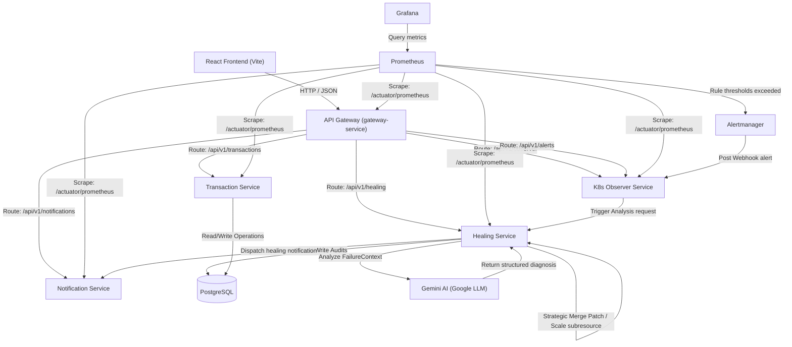

# Platform Architecture

This document describes the design, components, and interactions of the AI-Powered Self-Healing AIOps Platform.

---

## 🏗️ Architecture Diagram

Below is the orchestration and event propagation topology across the cluster:

---

## 📦 Microservices Breakdown

1.  **Gateway Service (Port 8080)**: Single point of entry. Routes external SRE queries to the respective services and applies global CORS filters.
2.  **Transaction Service (Port 8081)**: Simulates business traffic and implements a manual `/fault/oom` route to trigger out-of-memory container crashes for self-healing demonstration.
3.  **Healing Service (Port 8082)**: Core orchestrator. Leverages the Google Gemini API to analyze pod failure dumps, evaluate policies, and execute remediation (Strategic Merge Patch and Scale Subresource API calls).
4.  **Notification Service (Port 8083)**: Manages alerts and dispatches transactional and healing statuses to external targets.
5.  **K8s Observer Service (Port 8084)**: Listens for webhook payloads dispatched by Alertmanager and maps active pod state telemetry.

---

## 🔄 AI Healing Loop Execution Flow

1.  **Fault Trigger**: A memory leak or CPU utilization spike triggers an alert inside Prometheus.
2.  **Alerting**: Alertmanager captures the metric exception and posts a webhook payload to the Observer Service.
3.  **Context Scrape**: The Observer Service gathers pod specifications, node events, and the last 50 lines of logs, assembling a unified `FailureContext`.
4.  **AI Analysis**: The Healing Service queries the Gemini API with the `FailureContext`. Gemini returns an analysis schema containing diagnosis, reasoning, and recommended action.
5.  **Policy Validation**: Whitelist, confidence score, and frequency throttles are validated.
6.  **Remediation**: The deployment is scaled up/down (Scale API) or its memory boundaries are augmented (Strategic Merge Patch).
7.  **SRE Notification**: Notifications are broadcast and logged in the postgres auditing tables.
