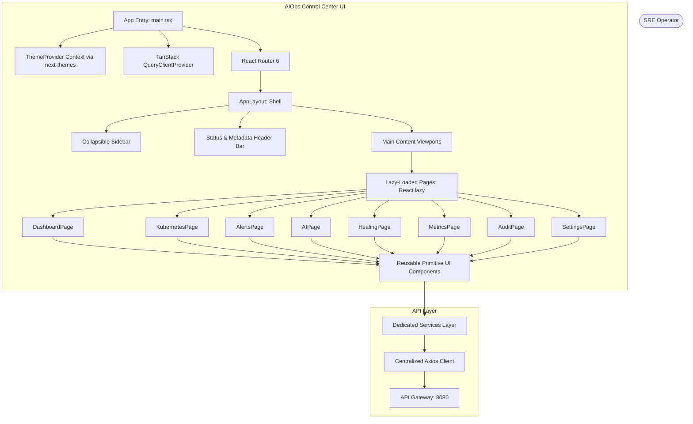
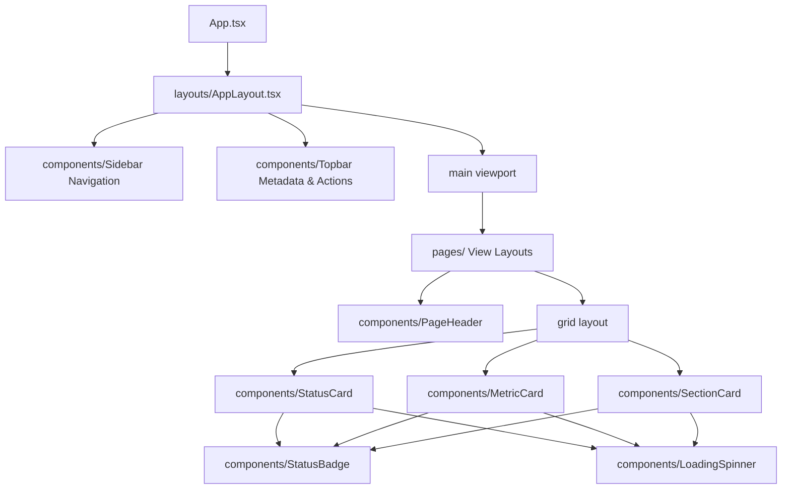

# Phase 4.1 - Frontend Foundation Design Document

This document outlines the architectural specifications, directory patterns, component hierarchies, state routing, and expansion strategies implemented to support the SRE Operations Dashboard.

---

## 1. Frontend Architecture Overview

The frontend is structured as a client-side Single Page Application (SPA) compiled with Vite, consuming backend APIs exclusively through the API Gateway (port 8080 LoadBalancer). It decouples layout, state loading, and api routing using modular hooks and custom providers.



---

## 2. Folder Structure

Absolute imports map to source sub-directories using the `@/` path alias.

```text
frontend/
├── .env.development      # API base URL for local development
├── .env.production       # API base URL for production builds
├── .env.example          # Template environment config
├── postcss.config.js     # PostCSS configurations
├── tailwind.config.js    # Tailwind colors and HSL variables
├── tsconfig.json         # Master TypeScript configuration
├── tsconfig.app.json     # App absolute path alias rules (@/*)
├── vite.config.ts        # Vite alias resolutions
└── src/
    ├── main.tsx          # Wrapper providers bootstrapping entry
    ├── App.tsx           # Global Router definitions
    ├── index.css         # Tailwind directives and Light/Dark HSL themes
    ├── vite-env.d.ts     # Strongly typed environment variable declarations
    ├── api/
    │   └── client.ts     # Centralized Axios client instance & interceptors
    ├── auth/
    │   └── index.ts      # Authentication session placeholders
    ├── realtime/
    │   └── index.ts      # WebSocket & SSE connection manager placeholders
    ├── services/
    │   ├── GatewayService.ts      # Gateway status integration placeholder
    │   ├── TransactionService.ts  # Transaction-service metrics placeholder
    │   ├── HealingService.ts      # AI diagnoses and self-heal action triggers
    │   ├── ObserverService.ts     # Kubernetes Alertmanager webhook feed
    │   ├── NotificationService.ts # Event notifications dispatch logs
    │   └── MetricsService.ts      # Prometheus actuator scrape endpoints
    ├── components/
    │   ├── FeedbackStates.tsx  # LoadingState, ErrorState, EmptyState, etc.
    │   ├── LoadingSpinner.tsx  # Dynamic loading animation
    │   ├── MetricCard.tsx      # Performance metrics displays
    │   ├── PageHeader.tsx      # View title and descriptions
    │   ├── SectionCard.tsx     # Standard layout box wraps
    │   ├── StatusBadge.tsx     # Color status pills
    │   └── StatusCard.tsx      # Platform status displays
    ├── hooks/
    │   └── useTheme.tsx  # Context provider wrapping next-themes library
    ├── layouts/
    │   └── AppLayout.tsx # collapsible Sidebar and Topbar viewport wrapper
    └── types/
        ├── api/          # Server states DTO models (FailureContext, AIAnalysisRecord)
        ├── ui/           # Front-end UI interfaces (NavItem, ThemeMode, ToastMessage)
        └── shared/       # Common types (UUID, CorrelationID, APIErrorResponse)
```

---

## 3. State Management Separation

The application strictly separates **Server State** (remote data retrieved from endpoints) from **Client UI State** (local user interactions, UI drawer states, and configuration toggles).

| Category | Technology | Target Responsibilities |
| :--- | :--- | :--- |
| **Server State** | **TanStack Query** (React Query) | - Server data caching & query invalidation<br>- Automatic loading & error state flags<br>- Automatic query refetches and retries |
| **Client UI State** | **React Context API** / Library Providers | - Local Theme switches (`next-themes`) persisted in localStorage<br>- Navigation drawer collapse status toggle<br>- Local Notification toaster list<br>- Future local session token tracking |

---

## 4. Theme Strategy

*   **Provider**: Implemented a context wrapper around the industry-standard `next-themes` library in [useTheme.tsx](file:///c:/Users/hp/Desktop/Project%20AIOPS/frontend/src/hooks/useTheme.tsx).
*   **Persistency**: Preferences are written automatically to `localStorage` under the key `aiops-ui-theme` and reloaded upon viewport boots.
*   **Default State**: System defaults to **Dark Mode** at initialization.
*   **System Theme Detection**: Inherits standard operating system preferences (using `enableSystem={true}`) when user overrides are not configured.
*   **Tailwind Integration**: Activates custom CSS classes on `document.documentElement` (`class="dark"`), enabling standard Tailwind utility classes to toggle HSL variables.

---

## 5. Routing & Performance Strategy

*   **Declarative Setup**: Managed in [App.tsx](file:///c:/Users/hp/Desktop/Project%20AIOPS/frontend/src/App.tsx) using React Router 6.
*   **Code Splitting**: All page packages under `src/pages/` are resolved asynchronously at run-time using React's dynamic `import()` and `React.lazy()`.
*   **Suspense Boundaries**: Transitions between views are encapsulated inside `<Suspense>` containers using our custom `LoadingState` spinner fallback to optimize core Web Vitals.
*   **Fallback 404 Route**: Catch-all routes (`path="*"`) load our custom `NotFoundState` component, displaying a return path to the dashboard.

---

## 6. Component Hierarchy



---

## 7. Responsive Strategy

*   **Viewport Scaling**: Mobile and Tablet viewports automatically toggle the sidebar drawer to hidden/collapsed using Tailwind break-points (`md` and `lg`).
*   **Tooltips on Collapsed Nav**: Hover states on collapsed navigation links trigger floating tooltip labels detailing view titles.
*   **Grid Reflows**: All grids utilize fluid layouts (`grid-cols-1 md:grid-cols-2 lg:grid-cols-4`) to transition from multi-column grids on desktop to single column scrolls on phones.

---

## 8. Services Layer Responsibilities

Business rules and API payload structures are decoupled from UI components. Rather than initiating direct Axios commands within UI views, operations are dispatched via static methods inside the `src/services/` layer, allowing structural changes to backend routes to be updated in a single place:
*   `GatewayService`: Coordinates API gateway routing metrics.
*   `TransactionService`: Scrapes transaction trace profiles and durations.
*   `HealingService`: Handles diagnoses history queries and manual action execution commands.
*   `ObserverService`: Tracks Alertmanager incoming payloads.
*   `NotificationService`: Audits system warnings.
*   `MetricsService`: Integrates scraping statuses.

---

## 9. Future Expansion Strategies

### Realtime Expansion Strategy (`src/realtime/`)
*   **WebSockets**: Real-time alarm updates and streaming logs will subscribe to standard websocket pathways (e.g., `ws://localhost:8080/ws/alerts`) routing through the gateway.
*   **Server-Sent Events (SSE)**: Standard graph time-series updates will read from SSE endpoints to push Prometheus metric ticks directly to cards without active HTTP polling.

### Authentication Expansion Strategy (`src/auth/`)
*   **JWT Token Handling**: Local storage will hold base64 encoded JWT tokens.
*   **Axios Handshake**: Interceptors inside `client.ts` will parse header maps and inject `Authorization: Bearer <token>` dynamically upon session validation.
*   **Scope Checks**: Route guards will check roles (e.g. `ROLE_SRE_ADMIN`) before enabling action triggers in `/settings`.

---

## 10. Dashboard Data Integrity Policy

The Operations Control Center displays live cloud-native infrastructure logs. To prevent security vulnerabilities or operational misunderstandings:
*   **No Simulated Metrics**: The UI will **NEVER** display generated, randomized, or simulated CPU, Memory, replicas count, or Alertmanager alarms.
*   **Default Display**: Every card, grid item, or graph will display **`Not Available Yet`** until backend endpoints are integrated.
*   **Strict Verification**: Backend integrations must fetch metrics exclusively from active Prometheus/Actuator API endpoints.
