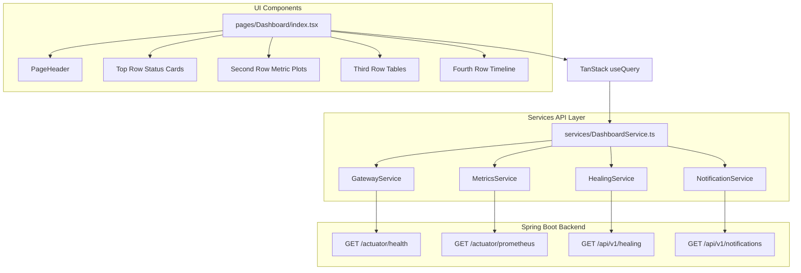

# Phase 4.2 - Dashboard & Backend Integration Document

This document outlines the architectural specifications, data flows, widget hierarchy, polling strategies, and performance optimizations implemented for the SRE Operations Dashboard.

---

## 1. Dashboard Architecture

The dashboard acts as a central operations terminal. It aggregates Gateway health actuators, Prometheus metrics, database transaction counts, and notification event logs.

---

## 2. Widget Hierarchy & Mapping

| Widget Name | Target Metric | Source Service | UI Fallback State (if endpoint missing) |
| :--- | :--- | :--- | :--- |
| **GatewayHealthCard** | Gateway Status | `GatewayService` | `OFFLINE` (If GET fails) |
| **ServiceStatusCard** | Microservices Health | None | `Backend endpoint unavailable` |
| **PodStatusCard** | Kubernetes Pod Count | None | `Backend endpoint unavailable` |
| **ActiveAlertsCard** | Alertmanager Ingestions | None | `Telemetry endpoint unavailable` |
| **MetricCard (CPU)** | system_cpu_usage | `MetricsService` | `0.0%` (Chart: `No Metrics Available`) |
| **MetricCard (Memory)** | jvm_memory_used_bytes | `MetricsService` | `N/A` (Chart: `No Metrics Available`) |
| **MetricCard (Latency)** | http_server_requests | `MetricsService` | `0 ms` |
| **MetricCard (AI)** | ai_analysis_duration | None | `Telemetry endpoint unavailable` |
| **AlertTable** | Alarm events feed | None | `Telemetry endpoint unavailable` |
| **DiagnosisTable** | Gemini diagnostics logs | None | `Telemetry endpoint unavailable` |
| **HealingTable** | Remediation operations | `HealingService` | `No recent healing operations` (EmptyState) |
| **Timeline** | Notification dispatches | `NotificationService` | `No recent notifications log` (EmptyState) |

---

## 3. Data Integration & Calculation Strategy

All calculations and string transformations are isolated inside the `src/services/` layer, leaving React components purely presentation-oriented:
1.  **Prometheus Scraping**: `MetricsService` parses raw text response from the Gateway's Prometheus endpoint. It matches labels starting with `system_cpu_usage` and `jvm_memory_used_bytes`, and calculates mean latencies from `http_server_requests_seconds_sum` divided by count.
2.  **Success Rate Calculation**: `DashboardService` iterates over the list returned by `/api/v1/healing` and calculates:
    $$\text{Success Rate} = \frac{\text{SUCCESS Operations}}{\text{Total Operations}} \times 100$$
3.  **Healings Today**: Filters operations starting with the current UTC date string (`YYYY-MM-DD`).
4.  **Chronological Sorting**: Both healing history and timeline notifications are sorted by newest timestamp first.

---

## 4. Refresh & Polling Strategy

To prevent cluster network congestion while keeping dashboard status accurate, the TanStack Query hook is configured with a default refetch interval:
*   **Active polling**: 15 seconds (`refetchInterval: 15000`).
*   **Retry count**: 1 retry offset (`retry: 1`) to fail gracefully and render localized `ErrorState` components rather than blocking the app.

---

## 5. Dashboard Data Integrity Policy

*   **No Synthetic Data**: Under no circumstances does the frontend simulate or guess CPU usage, Memory limits, Pod numbers, active alert feeds, or diagnoses latency.
*   **Honest Telemetry**: If a service endpoint is not exposed in the Gateway YAML router, it is rendered with a clear, professional unavailable tag (e.g. `Backend endpoint unavailable`).
*   **No Component Operations**: Calculations are executed strictly inside `src/services/DashboardService.ts` and `src/services/MetricsService.ts`.

---

## 6. Performance Considerations

*   **Aggregated Fetches**: `DashboardService` uses `Promise.all` to query all service endpoints concurrently, reducing total fetch latency.
*   **Lazy Loading**: The Dashboard component is lazy-loaded via `React.lazy()` and wrapped in `<Suspense>` boundaries.
*   **Rolling Memory Charts**: Recharts plots utilize a rolling React state array containing the last 15 ticks, preventing memory leaks from growing unbounded.
