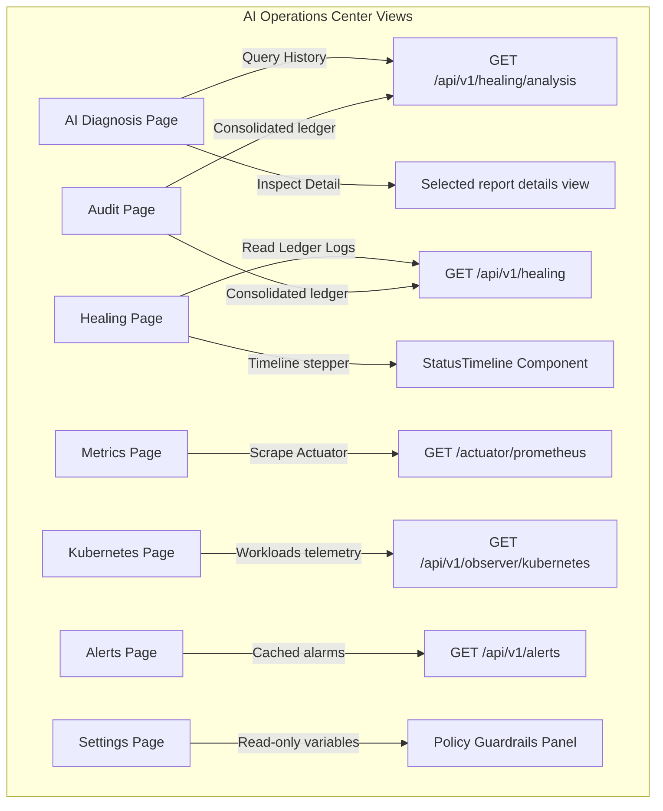

# Phase 4.3 - AI Operations Center Design Document

This document outlines the architectural specifications, component hierarchies, data mappings, and validation boundaries implemented to support the core SRE Operations Center views.

---

## 1. Page Architecture & Backend Mappings

Each view corresponds to active, read-only GET microservice endpoints exposed through the gateway:

### Exposing Read-only GET Endpoints

We exposed the following endpoints from the frozen microservices layer:

1.  **AI Analysis Logs (`GET /api/v1/healing/analysis`)**:
    *   *Microservice*: `healing-service` (`HealingController` → `HealingServiceImpl` → `AIAnalysisRecordRepository.findAll()`).
    *   *Path Pattern*: Routed through Gateway prefix `/api/v1/healing/**`.
2.  **Alertmanager Alarm Cache (`GET /api/v1/alerts`)**:
    *   *Microservice*: `k8s-observer-service` (`AlertController` storing items in a thread-safe `CopyOnWriteArrayList` cache).
    *   *Path Pattern*: Routed through Gateway prefix `/api/v1/alerts/**`.
3.  **Kubernetes Workloads Telemetry (`GET /api/v1/observer/kubernetes`)**:
    *   *Microservice*: `k8s-observer-service` (`ObserverController` → `KubernetesContextServiceImpl` → Kubernetes Java Client).
    *   *Path Pattern*: Routed through Gateway prefix `/api/v1/observer/**`.
    *   *Aggregates*: Namespaces, pods details (status, restart count), deployments (desired, ready), and services (type).

---

## 2. Reusable SRE Components

The following reusable widgets are exported under `src/components/`:
*   `JsonViewer.tsx`: Custom formatted collapsible code panel with Clipboard API copy buttons.
*   `ConfidenceBadge.tsx`: Colors AI confidence percentages (High >= 80% emerald, Medium >= 50% amber, Low rose).
*   `ExecutionBadge.tsx`: Displays execution statuses (SUCCESS green, PENDING pulsing amber, FAILED red, PARTIAL sky-blue).
*   `StatusTimeline.tsx`: Maps dynamic operation states to chronological steps:
    $$\text{Alert} \rightarrow \text{Context Enrichment} \rightarrow \text{Gemini Analysis} \rightarrow \text{Policy Validation} \rightarrow \text{Mutation Execution} \rightarrow \text{Post-Verification Check} \rightarrow \text{Success/Failure}$$

---

## 3. Data Integrity & Polling Policy

*   **Mock-free Integration**: Components consume real endpoints and fall back to professional offline indicators (e.g. `"Cluster telemetry endpoint unavailable"`) ONLY if the Kubernetes cluster connection is offline or microservices are unreachable.
*   **Decoupled Components**: All calculations are performed inside the `services/` layer (`DashboardService` and `MetricsService`). Components remain presentation-only.
*   **Active Polling**: Handled by TanStack Query using 15-second cycles for the healing logs, and 30-second cycles for Prometheus scraping.

---

## 4. Performance Considerations

*   **Client-Side Join correlation**: The SRE Audit Logs view performs a client-side join between `HealingOperation` logs and `AIAnalysisRecord` history using `correlationId` as the key. This maps AI confidence scores, diagnostics summaries, and analysis latencies dynamically without database changes.
*   **Code-Split Routing**: Page routes are code-split using `React.lazy()` and wrapped in `<Suspense>` loaders, optimizing SPA initial load bundle sizes.
