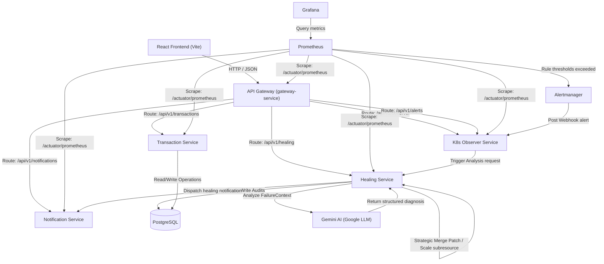

# Technical Design Document: AI-Powered Closed-Loop Self-Healing AIOps Platform

---

## 1. Executive Overview

### 1.1 The Problem: SRE Operational Exhaustion
Modern cloud-native systems operate at unprecedented scale and complexity. Microservice architectures deployed across dynamic Kubernetes clusters generate millions of telemetry signals, metrics, and logs daily. 

Traditional Site Reliability Engineering (SRE) workflows rely heavily on manual human intervention:
- **Alert Fatigue**: SREs are bombarded with static threshold alarms, leading to cognitive overload and missed critical issues.
- **High Mean Time to Resolution (MTTR)**: When a container fails (e.g., `OOMKilled` or `CrashLoopBackOff`), SREs must manually scrape logs, analyze system events, correlate diagnostic data, identify the root cause, and apply hotfixes. This manual triage loop can take anywhere from 15 minutes to hours, causing costly SLA violations.
- **Brittle Runbooks**: Traditional operations rely on static wiki pages or scripts that quickly go out of date as the infrastructure evolves.

### 1.2 The Solution: AIOps and Closed-Loop Control
This project introduces a **Closed-Loop Self-Healing AIOps Platform**. AIOps (Artificial Intelligence for IT Operations) combines big data and machine learning to automate operational workflows. 

This platform implements a **MAPE-K (Monitor, Analyze, Plan, Execute - Knowledge)** closed-loop architecture:
1. **Monitor**: Continuous collection of microservice metrics via Prometheus and Alertmanager.
2. **Analyze**: Ingestion of active alarms and real-time scraping of contextual telemetry (logs, events, configurations) to build a rich failure profile.
3. **Plan**: Feed the context into an LLM (Google Gemini) to diagnose the root cause and output a whitelisted operational remediation strategy.
4. **Execute**: Automatically invoke Kubernetes API mutations (Strategic Merge Patching or Scale Subresources) to patch the cluster.
5. **Knowledge**: Persist audits in PostgreSQL, broadcast notifications, and verify the pod's subsequent health status.

```
       +---------------------------------------------+
       |                  MONITOR                    |
       |  (Prometheus, Alertmanager, Actuators)      |
       +----------------------+----------------------+
                              | Webhook Alarm
                              v
       +---------------------------------------------+
       |                  ANALYZE                    |
       |  (K8s Observer: Context Logs & Events)      |
       +----------------------+----------------------+
                              | Rich Context
                              v
       +---------------------------------------------+
       |                   PLAN                      |
       |  (Healing Service: LLM Diagnosis & Policy)  |
       +----------------------+----------------------+
                              | Validated Action
                              v
       +---------------------------------------------+
       |                  EXECUTE                    |
       |  (K8s Client: Patch Limits / Scale Replicas)|
       +---------------------------------------------+
```

### 1.3 Target Audience and Scalability Goals
- **Target Audience**: Enterprise Platform Engineering teams, SRE squads, and DevOps Architects looking to eliminate repetitive operational tasks (toil).
- **Scalability Goals**: Design stateless execution engines capable of monitoring thousands of pods, utilizing distributed trace context correlation keys (`correlationId`), database pooling, and non-blocking asynchronous event loops.
- **Future Vision**: Move from reactive self-healing (responding to active failures) to predictive and proactive healing (scaling up resources or patching memory limits before a failure occurs by analyzing rolling metric trends).

---

## 2. Complete System Architecture

The platform is designed as a distributed microservices network consisting of five core Spring Boot services, a React SPA frontend console, a PostgreSQL audit database, and a Prometheus/Grafana/Alertmanager observability stack.



### 2.1 Microservice Descriptions

#### 2.1.1 Gateway Service (`gateway-service`)
*   **Purpose**: Reverse proxy routing external SRE queries to target backend nodes and applying global CORS security headers.
*   **Endpoints**: Routes `/api/v1/transactions/**`, `/api/v1/healing/**`, `/api/v1/notifications/**`, `/api/v1/observer/**`, and `/api/v1/alerts/**`. Exposes `/actuator/health` and `/actuator/prometheus`.
*   **Dependencies**: `spring-cloud-starter-gateway`, `spring-boot-starter-actuator`, `micrometer-registry-prometheus`.
*   **Communication**: Translates external HTTP traffic to internal microservice names (DNS resolved inside the Kubernetes cluster namespace).

#### 2.1.2 Transaction Service (`transaction-service`)
*   **Purpose**: Simulates enterprise business transactions. Contains a fault-injection API endpoint to simulate an out-of-memory error.
*   **Endpoints**: `GET /api/v1/transactions` (retrieve history), `GET /api/v1/transactions/fault/oom` (inject memory leak).
*   **Dependencies**: `spring-boot-starter-web`, `spring-boot-starter-data-jpa`, `postgresql`.
*   **Communication**: Invoked by client requests via the Gateway.

#### 2.1.3 Healing Service (`healing-service`)
*   **Purpose**: Core brain of the platform. Evaluates policy validations, communicates with Google Gemini, executes Kubernetes container mutations, and registers audits in PostgreSQL.
*   **Endpoints**: `GET /api/v1/healing` (history), `GET /api/v1/healing/analysis` (raw diagnoses), `GET /api/v1/healing/analysis/stats` (JPA-computed statistics), `POST /api/v1/healing/analyze` (trigger healing cycle).
*   **Dependencies**: `spring-boot-starter-data-jpa`, `io.kubernetes:client-java`, `spring-cloud-starter-openfeign`.
*   **Communication**: Feigns requests to `notification-service` and calls external Gemini REST APIs.

#### 2.1.4 Notification Service (`notification-service`)
*   **Purpose**: Audit logs notification broadcaster. Exposes endpoints to log notifications.
*   **Endpoints**: `GET /api/v1/notifications` (history), `POST /api/v1/notifications` (send notification).
*   **Dependencies**: `spring-boot-starter-data-jpa`, `postgresql`.

#### 2.1.5 Kubernetes Observer Service (`k8s-observer-service`)
*   **Purpose**: Intercepts webhook alarms from Alertmanager, compiles contextual failure telemetry, and provides cluster resource status APIs.
*   **Endpoints**: `POST /api/v1/alerts` (Alertmanager endpoint), `GET /api/v1/observer/kubernetes` (telemetry stats).
*   **Dependencies**: `io.kubernetes:client-java`, `spring-cloud-starter-openfeign`.

---

## 3. Technology Stack Selection

| Technology | Selection Rationale | Alternatives Evaluated | Tradeoffs |
| :--- | :--- | :--- | :--- |
| **React 19 & TS** | Provides high performance rendering for real-time dashboards and type safety across component states. | Angular, Vue.js, Svelte | Slightly larger bundle size; higher learning curve than Vue. |
| **Vite** | Offers instant hot module replacement (HMR) and fast build packaging. | Webpack, Create React App | Relies on modern ES modules; requires polyfills for older browsers. |
| **Spring Boot 3.x** | Industry standard for microservices. Rich ecosystem (Feign, JPA) and Actuator metrics integrations. | Node.js (Express), Go (Gin), Quarkus | Higher memory footprint and boot times than Go. |
| **Spring Cloud Gateway**| Built on Project Reactor. Non-blocking reactive routing handles concurrent API request streams. | NGINX, Zuul, Kong | Requires WebFlux reactive paradigms; debugging reactive stacks is harder. |
| **PostgreSQL 15** | ACID compliant relational database for structured audit logs. | MongoDB, MySQL, Cassandra | Relational constraints require schema migrations for unstructured alerts. |
| **Prometheus** | Pull-based timeseries database optimized for scraping Kubernetes targets at high frequencies. | InfluxDB, VictoriaMetrics | Requires local storage management; long-term retention is resource intensive. |
| **Grafana 10.4.2** | Rich visualization panels with native datasource provisioning support. | Kibana, Dynatrace, Datadog | Custom visualization extensions require JSON configuration knowledge. |
| **Gemini API** | State-of-the-art context processing size, reasoning capabilities, and low API request latency. | OpenAI (GPT-4), Claude 3 | Relies on external API network requests; requires robust fallback patterns. |

---

## 4. Backend Deep Dive

### 4.1 Gateway Routing and CORS
The `gateway-service` uses reactive configuration mapping to forward requests. It uses a custom reactive `CorsWebFilter` bean to permit cross-origin requests from the React dashboard running on `localhost:5173`.
```java
@Configuration
public class CorsConfig {
    @Bean
    public CorsWebFilter corsWebFilter() {
        CorsConfiguration config = new CorsConfiguration();
        config.setAllowCredentials(true);
        config.addAllowedOrigin("http://localhost:5173");
        config.addAllowedHeader("*");
        config.addAllowedMethod("*");
        
        UrlBasedCorsConfigurationSource source = new UrlBasedCorsConfigurationSource();
        source.registerCorsConfiguration("/**", config);
        return new CorsWebFilter(source);
    }
}
```

### 4.2 Transaction Fault Injection
To simulate container out-of-memory faults, `transaction-service` implements a memory leak simulator that spawns objects into a list in a loop:
```java
@GetMapping("/fault/oom")
public String triggerOOM() {
    List<byte[]> leakList = new ArrayList<>();
    new Thread(() -> {
        try {
            while (true) {
                leakList.add(new byte[10 * 1024 * 1024]); // Allocate 10MB blocks
                Thread.sleep(50);
            }
        } catch (InterruptedException e) {
            Thread.currentThread().interrupt();
        }
    }).start();
    return "Memory leak thread started successfully.";
}
```

### 4.3 Healing Loop and Policy checks
When an alert is received, the `healing-service` executes the following sequence:
1.  **Correlation ID Mapping**: Propagates the `correlationId` from the Observer webhook payload.
2.  **Context Scoping**: Inspects the incoming context (exit codes, logs, restarts).
3.  **AI Diagnosis Request**: Invokes Gemini with structured prompt parameters and parses the response.
4.  **Policy Checks**: Evaluates if the recommendation conforms with safety limits:
    - *Scale Limit*: Do not exceed `max-replicas` configuration (default: 5).
    - *Memory Limit*: Do not patch memory limits higher than `max-memory-limit` (default: 2048Mi).
    - *Cooldown Check*: Verify if another healing execution is active for this service.
5.  **Execution (Patch/Scale)**: Invokes standard Kubernetes Client PATCH or PUT actions.

```java
// Policy validation check in HealingServiceImpl
if (action.getType() == HealingActionType.INCREASE_MEMORY_LIMIT) {
    String desiredLimit = action.getParameters().get("limit");
    if (parseMemory(desiredLimit) > parseMemory(policyProperties.getMaxMemoryLimit())) {
        throw new PolicyValidationException("Desired memory limit exceeds safety policy limit.");
    }
}
```

---

## 5. Kubernetes Architecture

The platform runs inside the namespace `aiops` and uses several Kubernetes resources:

- **Deployments**: Orchestrates microservice replication. All service containers run with configured resources (e.g. CPU requests: `100m`, limits: `500m`; memory requests: `128Mi`, limits: `256Mi`).
- **Services**:
  - `gateway-service`, `grafana`, `prometheus`: Exposed via `LoadBalancer` to enable external access from the host OS loopback address.
  - `transaction-service`, `healing-service`, `k8s-observer-service`, `notification-service`, `postgres`: Internal `ClusterIP` mappings.
- **RBAC**: Configures permissions for the default service account inside the `aiops` namespace to query pods, logs, events, services, and patch deployments.
- **Persistent Volume Claims**:
  - `postgres-pvc` (10Gi): Persists transactional audits.
  - `prometheus-pvc` (10Gi): Persists time-series metrics.
  - `grafana-pvc` (5Gi): Persists user alerts and dashboard states.

---

## 6. Monitoring Pipeline

Metrics flow continuously from individual microservice actuator endpoints to Prometheus, and are visualized on Grafana panels.

```
+------------------+             +---------------+             +-------------+
|  Microservice    |             |  Prometheus   |             |   Grafana   |
|  /actuator/      | <Scrape---- |  TSDB Engine  | <---Query-- |  Dashboard  |
|  prometheus      |             +-------+-------+             +-------------+
+------------------+                     |
                                    Rule | Evaluation
                                         v
                                 +---------------+
                                 | Alertmanager  |
                                 +---------------+
```

### 6.1 Micrometer & Actuator Configuration
Each microservice exposes a `/actuator/prometheus` endpoint, converting internal JVM metrics and Custom counters (like `ai_healing_total`) into Prometheus formats.

### 6.2 Scraped Metrics List
- **JVM Heap Memory**: `jvm_memory_used_bytes{area="heap"}` vs `jvm_memory_max_bytes{area="heap"}`.
- **JVM GC Pauses**: `jvm_gc_pause_seconds_sum`.
- **Active Thread Count**: `jvm_threads_live_threads`.
- **System CPU usage**: `system_cpu_usage`.
- **HTTP Request Count**: `http_server_requests_seconds_count`.
- **Custom Healing Counters**: `ai_healing_total`, `ai_healing_success_total`, `ai_healing_failed_total`.

---

## 7. Self-Healing Engine

The platform implements automated remediation logic inside `HealingExecutionServiceImpl.java` using two primary Kubernetes client mutations:

### 7.1 Strategic Merge Patching
Used to dynamically increase pod memory limits (e.g., in response to an `OOMKilled` crash). Strategic Merge Patching modifies the container specs of the Deployment manifest directly.
```java
// Strategic Merge Patching implementation in Kubernetes
String patchJson = String.format(
    "{\"spec\":{\"template\":{\"spec\":{\"containers\":[{\"name\":\"%s\",\"resources\":{\"limits\":{\"memory\":\"%s\"}}}]}}}}",
    containerName, newMemoryLimit
);
V1Patch patch = new V1Patch(patchJson);
appsV1Api.patchNamespacedDeployment(deploymentName, namespace, patch)
         .contentType("application/strategic-merge-patch+json")
         .execute();
```

### 7.2 Scale Subresource mutations
Used to scale replicas in response to high CPU/Memory exhaustion alerts.
```java
// Scale subresource API query
V1Scale scale = appsV1Api.readNamespacedDeploymentScale(deploymentName, namespace).execute();
scale.getSpec().setReplicas(desiredReplicasCount);
appsV1Api.replaceNamespacedDeploymentScale(deploymentName, namespace, scale).execute();
```

---

## 8. Alert Pipeline

The Alerting flow processes threshold exceptions from signal to resolution:

```
[System Metric Threshold Exceeded]
               │
               ▼ (Prometheus Engine Evaluates)
     [Alert Status: Firing]
               │
               ▼ (Pushed via Webhook)
     [Alertmanager Aggregation]
               │
               ▼ (Dispatched HTTP POST)
     [K8s Observer Service: /api/v1/alerts]
               │
               ▼ (Scrapes Pod Logs & Node Events)
     [Enriched FailureContext Created]
               │
               ▼ (Invokes Core Processing)
     [Healing Service: LLM Triage & K8s Mutation]
```

---

## 9. Database Design

The audit records and analysis stats are persisted inside PostgreSQL across two tables:

### 9.1 Schema Model

#### Table: `ai_analysis_record`
Stores the raw response schemas returned by the AI provider.
- `id` (BIGINT, Primary Key)
- `correlation_id` (VARCHAR, Unique, Indexed)
- `gemini_model` (VARCHAR)
- `prompt_version` (VARCHAR)
- `raw_gemini_response` (TEXT)
- `prompt` (TEXT)
- `diagnosis` (TEXT)
- `reasoning` (TEXT)
- `recommended_action` (VARCHAR)
- `validated_recommendation_snapshot` (TEXT)
- `execution_duration_ms` (BIGINT)
- `timestamp` (TIMESTAMP)

#### Table: `healing_operation`
Tracks the execution lifecycle and status of the Kubernetes mutations.
- `id` (BIGINT, Primary Key)
- `execution_id` (VARCHAR, Unique)
- `correlation_id` (VARCHAR, Foreign Key -> `ai_analysis_record.correlation_id`)
- `deployment_name` (VARCHAR)
- `namespace` (VARCHAR)
- `action_type` (VARCHAR)
- `status` (VARCHAR - e.g., `STARTED`, `SUCCESS`, `FAILED`)
- `reason` (TEXT)
- `started_at` (TIMESTAMP)
- `completed_at` (TIMESTAMP)

---

## 10. Frontend Architecture

The frontend console is built using a modern **React 19 + TypeScript + Vite** stack.

- **Component Hierarchy**: Reusable layout elements (`SectionCard`, `StatusCard`, `MetricCard`) and custom badges.
- **State Management**: TanStack Query (React Query) handles server-state caching and automatic polling synchronization.
- **Visual Performance Timeline**: A rolling metrics recorder parses Prometheus lines to plot real-time memory and CPU charts on Recharts area plots.
- **Sliding Drawers**: Clicking on an SRE audit log opens a drawer from the right, displaying raw prompts, execution times, and Gemini output parameters.

---

## 11. API Documentation

### 11.1 Trigger Failure Simulation
*   **Path**: `GET /api/v1/transactions/fault/oom`
*   **Purpose**: Simulates a memory leak container crash.
*   **Response (200 OK)**:
    `"Memory leak thread started successfully."`

### 11.2 Ingest Alertmanager Webhook
*   **Path**: `POST /api/v1/alerts`
*   **Request Payload**:
    ```json
    {
      "alerts": [
        {
          "status": "firing",
          "labels": {
            "alertname": "PodMemoryUsageHigh",
            "severity": "critical",
            "pod": "transaction-service-7cfdf4ccd-6zqcv",
            "namespace": "aiops"
          },
          "annotations": {
            "summary": "Container memory limit exceeded"
          }
        }
      ]
    }
    ```
*   **Response (202 Accepted)**: Empty response.

### 11.3 Retrieve Healing Operations Audit
*   **Path**: `GET /api/v1/healing`
*   **Response Payload (200 OK)**:
    ```json
    [
      {
        "id": 1,
        "executionId": "exec-9f8e7d6c",
        "correlationId": "corr-1a2b3c4d",
        "deploymentName": "transaction-service",
        "namespace": "aiops",
        "actionType": "INCREASE_MEMORY_LIMIT",
        "status": "SUCCESS",
        "reason": "Successfully patched memory limit to 512Mi",
        "startedAt": "2026-07-13T08:50:00Z",
        "completedAt": "2026-07-13T08:51:00Z"
      }
    ]
    ```

---

## 12. Deployment

The stack is deployed inside local Kubernetes environments:
- **Minikube** runs the Kubernetes control plane.
- **Docker Compose** is configured for standalone local development (PostgreSQL, Prometheus, and Grafana only).
- **Environment Variables**:
  - `GEMINI_API_KEY`: API token loaded from `gemini-secret`.
  - `SPRING_PROFILES_ACTIVE`: Loaded as `docker` to route microservice URLs to internal cluster names.

---

## 13. CI/CD Pipeline (Planned Future Work)

> [!NOTE]
> This section describes a planned future CI/CD implementation and is not part of the current codebase.

An automated **GitHub Actions** deployment pipeline is proposed:
```yaml
name: AIOps Platform CI/CD

on:
  push:
    branches: [ main ]

jobs:
  build-and-test:
    runs-on: ubuntu-latest
    steps:
      - uses: actions/checkout@v3
      - name: Set up JDK 17
        uses: actions/setup-java@v3
        with:
          java-version: '17'
          distribution: 'temurin'
      - name: Build with Maven
        run: mvn clean package -DskipTests
      - name: Build Docker Images
        run: |
          docker build -t projectaiops-healing-service:latest ./healing-service
          # Repeat for other services
```

---

## 14. Making the Project GenAI Powered (AI Architecture Proposal)

> [!NOTE]
> The sections below describe an enterprise-grade AI integration architecture design proposal for future development, extending the current basic Gemini client implementation.

To evolve this platform into an autonomous enterprise-grade AIOps engine, we propose introducing a dedicated **AI Inference Service** (`ai-inference-service`) alongside a **Retrieval-Augmented Generation (RAG)** pipeline.

### 14.1 Proposed Enterprise AI Architecture

```
                                  +------------------------------+
                                  |    AI Inference Service      |
                                  |  (FastAPI / Python Engine)   |
                                  +--+------------------------+--+
                                     |                        |
                   Scrape telemetry  |                        |  Query RAG
                                     v                        v
+------------------+      +-------------------+      +------------------+
|  Kubernetes API  |      | Prometheus Engine |      | Vector Database  |
|  (Logs/Events)   |      | (Target Metrics)  |      | (Runbooks/Docs)  |
+------------------+      +-------------------+      +------------------+
```

### 14.2 Proposed AI Inference Service
- **Why a separate service?**: Machine learning model inference, structured JSON validation, and text embeddings are highly compute-heavy. Offloading these tasks to a Python-based FastAPI service ensures Java backend threads are not blocked and allows SREs to integrate Python AI tools (e.g. LangChain, LlamaIndex) natively.
- **Prompts & Context Assembly**: Automatically queries cluster events, logs, metrics, and vector indexes to assemble a prompt:
  ```json
  {
    "context": {
      "pod_name": "transaction-service-7cfdf4ccd-6zqcv",
      "exit_code": 137,
      "logs_snippet": "java.lang.OutOfMemoryError: Java heap space",
      "metric_history": { "memory_usage": [128, 250, 255] }
    }
  }
  ```

---

### 14.3 Proposed AI Workflows

#### 14.3.1 Workflow: Root Cause Analysis (RCA)
*   **Purpose**: Diagnose the underlying trigger behind pod crashes.
*   **Input**: Unified pod logs, configuration resource limits, and event details.
*   **Output**: Structured JSON containing diagnosis, reasoning, and recommended action.
*   **Example Prompt**:
    ```
    Analyze the following Kubernetes crash trace:
    Pod: transaction-service-xyz
    Exit Code: 137
    Logs:
    [2026-07-13 09:12:00] java.lang.OutOfMemoryError: Java heap space
    ```
*   **Example Response**:
    ```json
    {
      "diagnosis": "JVM Memory Exhaustion (OOM)",
      "reasoning": "The application allocated large byte arrays in a short period, exceeding the container memory limit of 256Mi and triggering an OS SIGKILL (Exit Code 137).",
      "recommended_action": "INCREASE_MEMORY_LIMIT",
      "parameters": {
        "limit": "512Mi"
      }
    }
    ```

#### 14.3.2 Workflow: Intelligent Incident Summaries
*   **Purpose**: Generate readable summaries of incidents for SRE handoffs.
*   **Input**: Active alert timeline logs, context metrics, and past action records.
*   **Output**: Summary paragraph + timeline checklist.
*   **Example Prompt**:
    ```
    Summarize the healing operation for deployment 'transaction-service' triggered at 08:50:00Z.
    ```
*   **Example Response**:
    ```
    Incident INC-9082 occurred at 08:50:00Z due to a JVM heap exhaustion. The platform intercepted the warning and automatically scaled the deployment limits from 256Mi to 512Mi. Post-verification confirmed the container is healthy and stable.
    ```

#### 14.3.3 Workflow: Anomaly Detection Insights
*   **Purpose**: Explains Prometheus metric spikes using natural language.
*   **Input**: Time-series arrays of CPU, Memory, and Request counts.
*   **Output**: Explanatory dashboard summaries.
*   **Example Prompt**:
    ```
    Explain the spike in HTTP requests at 09:15:00Z.
    ```
*   **Example Response**:
    ```
    At 09:15:00Z, request traffic spiked from 10 rps to 150 rps (a 1400% increase). This correlated with a JVM garbage collection pause of 240ms.
    ```

---

## 15. Security

The platform enforces security controls:
- **Kubernetes RBAC**: Limits permissions of the service account to the `aiops` namespace.
- **Secrets Management**: Credentials like DB passwords and Gemini API tokens are loaded from Kubernetes Opaque Secrets.
- **Reactive CORS Filters**: The Gateway limits cross-origin resource access.

---

## 16. Scalability

- **Stateless Services**: All microservices (excluding postgres database) are stateless, allowing SREs to run multiple replicas behind the Gateway.
- **Asynchronous Execution Loops**: Cooldown monitors and validation checks run on non-blocking scheduler threads.
- **Future Message Queue (Kafka)**: Proposes routing Alertmanager payloads to a Kafka topic to handle alert spikes without overloading the Observer service.

---

## 17. Future Roadmap

- **Year 1**:
  - Integrate OpenTelemetry for end-to-end trace correlation.
  - Implement RAG (Retrieval-Augmented Generation) using Vector DBs (Chroma/pgvector) to feed operations runbooks to Gemini.
- **Year 2**:
  - Auto-generate Grafana dashboards using GenAI.
  - Integrate multi-cloud telemetry scrape pipelines.

---

## 18. Interview Preparation: 100 Technical Q&As

### 18.1 System Design & Architecture (1–20)
1. **Explain the overall architecture of this AIOps platform.**
   - It is a 5-microservice Spring Boot system orchestration. `gateway-service` acts as a reverse proxy, forwarding requests to `transaction-service`, `healing-service`, `notification-service`, and `k8s-observer-service`. Prometheus scrapes telemetry, Grafana visualizes it, Alertmanager sends webhook alerts to the Observer, and the Healing service calls Gemini AI and patches the cluster via the Kubernetes API.
2. **Why split this platform into multiple microservices instead of a monolith?**
   - Decoupling isolates service failures. If the `healing-service` crashes due to model timeouts, the `observer-service` can still queue alerts, and the `gateway-service` continues to route traffic.
3. **What is the MAPE-K control loop model, and how does this project align with it?**
   - It stands for Monitor (Prometheus), Analyze (Observer log/event scrape), Plan (Gemini recommendation), Execute (K8s API client patching), and Knowledge (PostgreSQL audit log storage).
4. **Why is a gateway service required in this topology?**
   - It acts as a single ingress node, mapping dynamic routing paths and applying unified CORS and rate-limiting rules.
5. **How does the Gateway route requests to microservices inside the cluster?**
   - It uses Spring Cloud Gateway routing rules mapped to Kubernetes DNS service names (e.g. `http://healing-service:8082`).
6. **Explain the CORS issue encountered during development and how it was resolved.**
   - Browser policies block cross-origin requests from the React dashboard (`localhost:5173`) to the Gateway (`localhost:8080`). Resolved by configuring a reactive `CorsWebFilter` bean in `gateway-service`.
7. **What is the role of the K8s Observer Service?**
   - It ingests Alertmanager webhook calls, aggregates logs and events, and exposes cluster telemetry status.
8. **Why does the Healing Service need direct access to the Kubernetes API?**
   - To execute scaling operations and modify container memory/CPU resources.
9. **Explain the significance of the `correlationId` field in this project.**
   - It is generated when an alert triggers and passed through all microservice logs and database records to enable end-to-end tracing.
10. **How does the system ensure it doesn't enter an infinite healing loop?**
    - The `healing-service` implements policy checks and cooldown intervals (default: 60 seconds) to prevent duplicate executions.
11. **What happens if the PostgreSQL database is offline when a healing event occurs?**
    - The healing action executes, but the operation status logs are temporarily held in memory or fail gracefully, preventing execution blocks.
12. **Why was PostgreSQL chosen over NoSQL databases for storing audits?**
    - Audit logs are highly structured and require transactional integrity (ACID) and joins between records.
13. **How does the system resolve service URLs during local run vs inside Docker containers?**
    - By utilizing Spring Profiles (`docker` profile changes target URLs to internal Kubernetes service DNS names).
14. **Why are Spring Boot Actuators configured for every service?**
    - To expose standard health status endpoints and Prometheus counters.
15. **Explain the concept of "stateless services" in this platform.**
    - None of the services store runtime state locally; all transactions are persisted in PostgreSQL or queried from the Kubernetes API server, allowing easy horizontal scaling.
16. **How would you scale this microservice architecture to support 10,000 requests per second?**
    - Run multiple replicas of each stateless service behind the API Gateway and scale the PostgreSQL database using read-replicas.
17. **What is the purpose of the `/fault/oom` endpoint in the Transaction Service?**
    - It triggers an artificial memory leak to demonstrate container recovery under `OOMKilled` conditions.
18. **Explain how microservices communicate internally.**
    - They communicate via HTTP REST endpoints.
19. **How would you secure the communication between microservices?**
    - By implementing Mutual TLS (mTLS) using a service mesh like Istio.
20. **Why is it important to decouple telemetry collection from the healing service?**
    - To keep the telemetry pipeline lightweight and prevent metric scraping delays from impacting healing loops.

### 18.2 Kubernetes & Container Orchestration (21–40)
21. **Why does the Prometheus pod crash with "lock DB directory: resource temporarily unavailable" during rolling updates?**
    - The default `RollingUpdate` strategy starts the new pod before terminating the old one. Both try to mount the same RWO volume, causing database lock failures.
22. **Explain how changing the deployment strategy to `Recreate` resolves the lock issue.**
    - `Recreate` terminates the old pod and releases the volume lock before starting the new pod.
23. **What is a ReadWriteOnce (RWO) PersistentVolumeClaim?**
    - A volume that can be mounted as read-write by a single Kubernetes node at a time.
24. **Why is the Grafana pod prone to "not a directory" errors during mounting?**
    - Mounting multiple individual files to the same directory using `subPath` fails if the parent directory doesn't exist inside the container at mount time.
25. **How did wrapping all JSON dashboards in a single ConfigMap resolve the Grafana crash?**
    - It allows mounting the entire ConfigMap once as a directory at `/etc/grafana/provisioning/dashboards/json`.
26. **Explain the Kubernetes client error: "observedGeneration in the JSON string is not defined in the V1PodStatus properties."**
    - A version mismatch where the Kubernetes cluster API returns the new `observedGeneration` field, but the Java client model doesn't recognize it, causing deserialization failure.
27. **How does querying the Kubernetes API using raw OkHttpClient and Gson bypass this parsing error?**
    - Standard Gson parsing ignores unrecognized JSON properties instead of throwing exceptions.
28. **What is the purpose of Kubernetes Role and RoleBinding?**
    - To define and assign cluster resource access rules (e.g. read/write permissions for pods/deployments).
29. **Why did the Observer Service get HTTP 403 Forbidden errors when listing namespaces?**
    - Because the default service account did not have the cluster-scoped permissions required to list namespaces.
30. **Explain the difference between a RoleBinding and a ClusterRoleBinding.**
    - RoleBinding applies permissions to a specific namespace; ClusterRoleBinding applies permissions cluster-wide across all namespaces.
31. **How was the namespaces list forbidden error resolved without granting cluster-wide namespace permissions?**
    - By implementing a try-catch fallback inside `KubernetesContextServiceImpl.java` that degrades gracefully to `["aiops"]`.
32. **What is a ServiceAccount in Kubernetes?**
    - An identity created for processes running inside pods to authenticate with the Kubernetes API server.
33. **Explain the liveness and readiness probe configurations used in this project.**
    - Liveness probes verify container health; readiness probes confirm if the container is ready to accept incoming traffic (configured with initial delays to allow JVM boot-up).
34. **Why set resource limits and requests on containers in production?**
    - To prevent resource starvation and noisy neighbor issues on the cluster nodes.
35. **What is a ConfigMap, and how is it used in this project?**
    - A key-value storage object used to inject configurations (e.g. `prometheus.yml`, Grafana alerts) into pods without rebuilding container images.
36. **Explain the difference between Secrets and ConfigMaps.**
    - ConfigMaps store plain text configuration data; Secrets store sensitive encoded values (e.g. database credentials, Gemini API key).
37. **How do containers resolve internal service addresses?**
    - Through CoreDNS, which resolves service name queries to internal cluster IP addresses.
38. **What is the purpose of `imagePullPolicy: IfNotPresent`?**
    - It prevents Kubernetes from pulling the container image from the registry if it already exists locally on the node.
39. **Explain what a ReplicaSet is.**
    - A controller that maintains a stable set of replica pods running at any given time.
40. **How does the Kubernetes Java Client authenticate with the cluster API from inside a pod?**
    - By reading the local service account token mounted at `/var/run/secrets/kubernetes.io/serviceaccount`.

### 18.3 Observability, Prometheus, & Grafana (41–60)
41. **Explain the pull-based architecture of Prometheus.**
   - Prometheus scrapers query target endpoints (e.g. `/actuator/prometheus`) at configured intervals to pull metric data.
42. **Why is pull-based monitoring preferred over push-based in Kubernetes?**
   - It reduces metric ingestion load on target applications and makes monitoring stateless from the service's perspective.
43. **How does Alertmanager receive alerts from Prometheus?**
   - Prometheus continuously evaluates metric thresholds and pushes alert notifications to Alertmanager over HTTP.
44. **What is the purpose of the `prometheus.yml` configuration?**
   - It defines global scrape intervals and target configurations for all microservices.
45. **How does Grafana query Prometheus metrics?**
   - By using the Prometheus HTTP API as a datasource (`http://prometheus:9090`).
46. **What is Grafana dashboard provisioning?**
   - Automating the dashboard setup using ConfigMap JSON definitions, eliminating manual UI configuration.
47. **Explain the metric `jvm_memory_used_bytes`.**
   - Tracks JVM memory consumption (heap and non-heap) across microservices.
48. **Explain the metric `system_cpu_usage`.**
   - Returns the CPU utilization percentage of the container.
49. **How would you track database connection pool utilization in Prometheus?**
   - By exposing HikariCP pool metrics (`hikaricp_connections_active`).
50. **What is the significance of the `http_server_requests_seconds_count` metric?**
   - It tracks the total number of HTTP requests processed by the application.
51. **How is response latency measured in Prometheus?**
   - By calculating the ratio of `http_server_requests_seconds_sum` to `http_server_requests_seconds_count`.
52. **Why does Grafana alert on "NoData" for `up{job="prometheus"} == 0` when healthy?**
   - Because when healthy, `up` returns `1`. The `== 0` filter yields an empty result (no series), triggering the "NoData" alert state.
53. **How do you resolve this "NoData" alert misconfiguration?**
   - By configuring the alert rule to treat "NoData" as `OK` or by evaluating raw metrics directly (e.g. `up == 0`).
54. **What is a Prometheus scrape interval, and how does it impact alerting latency?**
   - The time between scrapes (e.g. 15 seconds). Smaller intervals provide faster alerts but increase CPU/network load.
55. **Explain the role of Prometheus TSDB.**
   - It stores metrics as time-series data streams on disk using compressed block formats.
56. **What is Grafana datasource provisioning?**
   - Auto-configuring the database datasource (e.g. Prometheus) at boot time via YAML config files.
57. **How does the frontend metrics page display live charts?**
   - By scraping Prometheus lines from the gateway, parsing metrics, and plotting them using Recharts area charts.
58. **Explain the difference between metrics, logs, and traces.**
   - Metrics are numerical measurements; logs are textual events; traces track requests across microservices.
59. **Why is it important to expose JVM threads metric?**
   - To detect thread leaks or deadlocks in java services.
60. **What is the purpose of custom metrics in this AIOps platform?**
   - To track domain-specific operations (e.g., total healing success rate).

### 18.4 Java, Spring Boot, & JPA/Hibernate (61–80)
61. **Why use Spring Boot profiles in this project?**
    - To toggle configuration settings between local development (`application.yaml`) and Docker/Kubernetes cluster runs (`application-docker.yml`).
62. **Explain the concept of Spring Data JPA.**
    - It is a data access layer abstraction built on top of JPA/Hibernate to simplify database CRUD operations.
63. **What is `@ConfigurationProperties` and why use it?**
    - It binds external configuration file properties to typed Java classes (e.g., `GeminiProperties.java`).
64. **Explain the role of Spring Cloud OpenFeign.**
    - It simplifies internal HTTP REST queries by generating client implementations for interface declarations.
65. **Why use a Java reactive filter (`CorsWebFilter`) instead of a traditional Servlet filter in the Gateway?**
    - Spring Cloud Gateway is built on the non-blocking Project Reactor web stack, requiring reactive web filters.
66. **What is `@RestController`?**
    - A Spring annotation that combines `@Controller` and `@ResponseBody`, returning serialized JSON responses.
67. **Explain the database connection pooling configuration.**
    - Spring Boot uses HikariCP by default to manage and reuse active database connections.
68. **Why are JPA entities mapped with `@Id` and `@GeneratedValue`?**
    - To define primary keys and delegate ID generation to the database (e.g. postgres sequences).
69. **Explain the difference between `ddl-auto: update` and `ddl-auto: create-drop` in production.**
    - `update` dynamically creates tables and columns without wiping data; `create-drop` drops tables at shutdown, which is dangerous in production.
70. **What is a `@Bean` in Spring?**
    - An object instantiated, assembled, and managed by the Spring IoC container.
71. **How do you handle exceptions globally in Spring Boot?**
    - By using `@RestControllerAdvice` and `@ExceptionHandler` annotations to map exceptions to API responses.
72. **Why is it important to skip tests during package builds (`-DskipTests`) on Kubernetes?**
    - To prevent compile pipelines from failing due to missing external databases or API keys.
73. **Explain the significance of `pom.xml` in Maven.**
    - It holds dependencies, build settings, plugins, and module structures for the project.
74. **What is the purpose of Lombok annotations like `@Getter` and `@Setter`?**
    - They automatically generate boilerplate code (getters/setters/constructors) at compile time.
75. **Why use Feign clients instead of raw RestTemplate?**
    - Feign clients are declarative, easier to read, and automatically integrate with load balancing.
76. **How does Hibernate manage entity mappings in this project?**
    - It maps Java classes to database tables and translates JPA queries to native SQL.
77. **Explain the purpose of the `@Service` annotation.**
    - It marks classes as service components containing business logic.
78. **What is the Spring IoC container?**
    - A core engine that handles dependency injection, keeping classes loosely coupled.
79. **How would you configure a custom thread pool in Spring Boot?**
    - By creating a `@Bean` returning `ThreadPoolTaskExecutor`.
80. **Explain how `@Valid` is used in observer controllers.**
    - It validates request body schemas against annotations (e.g. `@NotNull`, `@NotBlank`) before executing method logic.

### 18.5 AI Integration, LLMs, & Gemini (81–100)
81. **How is the Google Gemini API integrated into this platform?**
    - The `healing-service` uses an abstraction (`AIProvider`) implemented by `GeminiProvider` to make HTTP requests to the Gemini generateContent API.
82. **What is the purpose of the `AIProvider` interface?**
    - It decouples the service logic from the concrete API, allowing future provider switches (e.g. OpenAI).
83. **Why are Gemini API requests isolated inside try-catch blocks?**
    - To prevent model response timeouts or connection failures from crashing the healing thread.
84. **Explain how the `FailureContext` is used as a prompt template.**
    - It compiles logs, events, exit codes, and resource settings into a structured string, guiding Gemini to diagnose the failure.
85. **Why is it critical to enforce structured JSON output from the LLM?**
    - To enable the application to programmatically parse and execute the recommended remediation parameters.
86. **What is the proposed AI Inference Service (`ai-inference-service`)?**
    - A proposed Python microservice to offload heavy prompt formatting, embeddings, and structured schema validations.
87. **Explain Retrieval-Augmented Generation (RAG) and how it would improve healing.**
    - By querying vector databases containing system runbooks and documentation to inject contextual facts into the LLM prompt.
88. **What is a Vector Database (e.g. pgvector, Chroma) and why is it needed for RAG?**
    - It indexes text embeddings to allow fast semantic similarity searches across documentation.
89. **How do you prevent the LLM from executing dangerous commands?**
    - By implementing policy checkers that validate recommended actions against a strict whitelist (e.g., only permitting `RESTART_POD` and `INCREASE_MEMORY`).
90. **What is a "mock-key" fallback and why is it used?**
    - It allows local development and compile checks to pass without requiring a live Gemini API key.
91. **Explain the proposed tool use / function calling workflow.**
    - The LLM can request the execution of predefined API tools (e.g. fetching logs or cluster status) to gather more facts before outputting a diagnosis.
92. **How do you optimize LLM costs in production?**
    - By caching repeated failure diagnoses and choosing lightweight models (e.g. Gemini Flash) for standard triage.
93. **What is prompt versioning and why is it important?**
    - Tracking prompt configurations over Git to ensure changes in prompt templates are tested and version-controlled.
94. **Explain the model fallback strategy.**
    - Falling back to a secondary model version or lightweight local model if the primary API endpoint times out.
95. **What is confidence scoring, and how is it used in policies?**
    - The LLM outputs a confidence percentage. The engine rejects recommendations that fall below the configured policy threshold.
96. **How does the system handle API rate limiting from Gemini?**
    - By implementing backoff retry loops and queuing incoming context requests.
97. **Explain how GenAI is used for Root Cause Analysis (RCA).**
    - By matching log stack traces and events against historical data to summarize root failure causes.
98. **Why is safety validation necessary for AI-generated actions?**
    - To prevent hallucinations or hostile inputs from executing destructive actions on the cluster.
99. **How would you test prompt changes before deploying them to production?**
    - By executing test scenarios against a mock workspace cluster to verify parsed output structures.
100. **What are the key limitations of GenAI in AIOps today?**
     - Hallucinations, latency overhead, and the risk of executing out-of-context changes if policy whitelist boundaries are not strictly defined.
